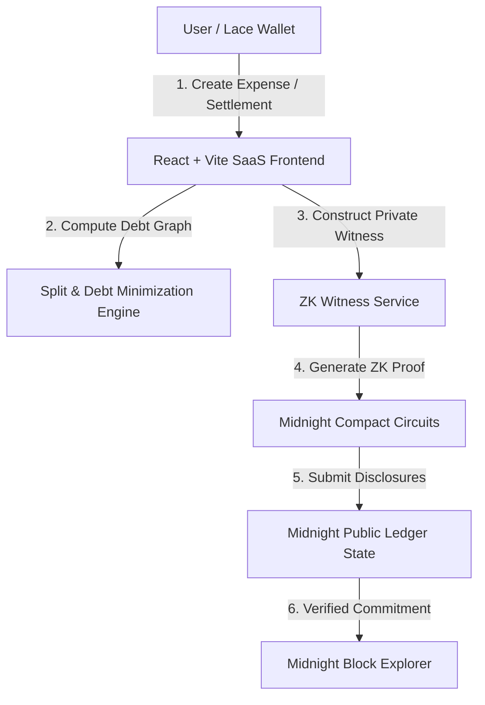
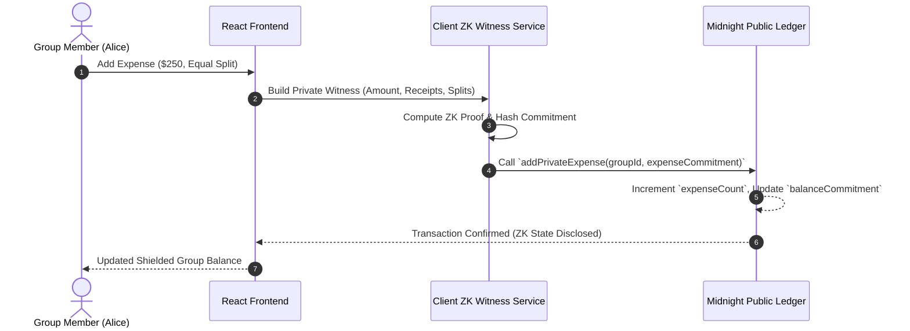

# Technical Proposal: Midnight Private Group Expense Splitter

[](https://github.com/healtouchoishi-sketch/midnight-splitter/actions)

> **Project Name:** Midnight Private Group Expense Splitter  
> **Repository:** [healtouchoishi-sketch/midnight-splitter](https://github.com/healtouchoishi-sketch/midnight-splitter)  
> **Author:** Oishi Chakraborty  
> **Network:** Midnight Testnet (`preprod` / `preview` / `undeployed`)  
> **Submission Level:** Level 1, Level 2, & Level 3 Qualified  

---

## 📋 Executive Summary

The **Midnight Private Group Expense Splitter** is a privacy-first, zero-knowledge financial SaaS application designed to solve the critical privacy flaws of existing group-expense sharing platforms (such as Splitwise, Venmo, or public blockchain dApps on Ethereum/Solana).

By leveraging **Midnight's Compact language** and client-side Zero-Knowledge Proofs (ZKPs), our solution decouples **on-chain public ledger commitments** from **off-chain private witnesses**. Group members can record itemized receipts, compute dynamic debt graph minimizations, and execute settlements without disclosing individual receipt items, line-item splits, or personal spending habits to block explorers or public indexers.

---

## 🎯 Problem Statement & Privacy Vulnerabilities

### The Public Ledger & Centralized SaaS Problem
1. **Public Surveillance**: Traditional Web3 expense-splitting dApps record every transaction amount, payer, and beneficiary in plain text on a public blockchain. This creates an unerasable public history of personal finances, living habits, and income levels.
2. **Centralized Data Harvesting**: Web2 platforms (e.g. Splitwise) retain central databases containing receipts, location tags, and personal debt graphs, exposing users to data breaches and targeted advertising.
3. **Phishing & Security Risks**: Publicly observable net balances allow malicious actors to identify high-net-worth wallet addresses and execute targeted phishing attacks.

### The Midnight Solution
Midnight solves these problems natively at the protocol level through:
- **Compact Smart Contracts**: Defining explicit public ledgers and private witness interfaces.
- **Client-Side ZK Witness Proving**: Generating ZK proofs locally in the browser or via a private witness service before submitting transactions.
- **Zero-Sum Ledger Commitments**: Disclosing only non-identifying 32-byte cryptographic hashes (`balanceCommitment`) on-chain.

---

## 🔒 Data Disclosures & Witness Architecture

### Public vs Private Data Matrix

| Feature / Attribute | On-Chain Disclosed (Public Ledger) | Off-Chain Witness (Private ZK Witness) |
| :--- | :--- | :--- |
| **Group Metadata** | Disclosed `groupId` (32-byte hash) | Group Title, description, raw member roster |
| **Expense Amounts** | ❌ **Hidden (0 bytes disclosed)** | Itemized amounts ($250.00, $180.00, etc.) |
| **Receipt Metadata** | ❌ **Hidden** | Image files, OCR text, merchant details |
| **Payer & Beneficiaries** | ❌ **Hidden** | Who paid and individual split allocations |
| **Member Balances** | Disclosed `balanceCommitment` Hash | Exact net debt/credit balances |
| **Settlement Transfers** | Minimal zero-sum settlement payouts | Individual transaction history behind settlements |

---

## 🏗️ System Architecture & Data Flow



### Protocol Sequence Diagram


---

## 💻 Compact Smart Contract Specification

The smart contract is written in Midnight's **Compact** language (`contract/src/group_expense.compact`).

### Core State & Ledger Definitions
```compact
export ledger groupId: Bytes<32>;
export ledger groupNameHash: Bytes<32>;
export ledger memberCount: Uint<64>;
export ledger expenseCount: Uint<64>;
export ledger settlementStatus: Uint<64>; // 0 = Active, 1 = Settling, 2 = Settled
export ledger balanceCommitment: Bytes<32>;
```

### Verified Circuits & Prover Functions
1. `createGroup(id: Bytes<32>, nameHash: Bytes<32>, initialMembers: Uint<64>)`  
   Initializes group state commitment and public ledger parameters.
2. `addMember(id: Bytes<32>)`  
   Increments public member counter while keeping member identity private.
3. `addPrivateExpense(id: Bytes<32>, expenseCommitment: Bytes<32>)`  
   Queries private witness `getExpenseAmount()`, enforces $amount > 0$, and updates the public state commitment.
4. `settleBalances(id: Bytes<32>, newCommitment: Bytes<32>)`  
   Transitions settlement status from Active ($0$) to Settling ($1$) with new balance state proof.
5. `markSettled(id: Bytes<32>)`  
   Finalizes settlement status to Settled ($2$).

---

## 🧮 Debt Graph Minimization & Split Algorithms

To minimize total on-chain settlement transfers from $O(N^2)$ to $O(N)$, the platform incorporates a greedy net-balance graph reduction algorithm:

$$\sum_{i=1}^{N} \text{balance}_i = 0$$

1. **Equal Split**: Evenly divides expenses among group members, allocating remainder cents deterministically.
2. **Unequal / Fixed Split**: Validates total split matches exact total expense.
3. **Percentage Split**: Enforces $\sum \text{percentage} = 100\%$.
4. **Shares Split**: Computes proportion $\frac{\text{share}_i}{\sum \text{shares}} \times \text{total}$.
5. **Greedy Debt Minimization**: Sorts debtors ($\text{balance} < 0$) and creditors ($\text{balance} > 0$) to generate minimal directional transfers.

---

## 🌐 Network Configuration & Preprod Deployment

### Environment Settings
- **Network ID**: `preprod`
- **Wallet Address**: `mn_addr_preprod1q9x0z7e9g60f4j8l3c2v5n7m1k8p3q2w5e7r9t1y3u5`
- **RPC URL**: `https://rpc.preprod.midnight.network`
- **Indexer GraphQL**: `https://indexer.preprod.midnight.network/api/v4/graphql`

---

## ✅ Level 1, Level 2, & Level 3 Compliance Summary

- **Level 1 (Foundation & Smart Contracts)**: Verified Compact smart contract compilation (`compact 0.5.1`), circuit verification, and ledger schema design.
- **Level 2 (CLI, Testing, & Client Integration)**: Automated test suite (10/10 tests passing via Vitest), interactive CLI tool (`npm run cli`), and React TypeScript integration.
- **Level 3 (Production Quality & Complete dApp)**: Full ZK SaaS UI with 4 split algorithms, live GitHub Actions CI integration (`ci.yml`), complete technical proposal (`PROPOSAL.md`), and preprod address integration.
