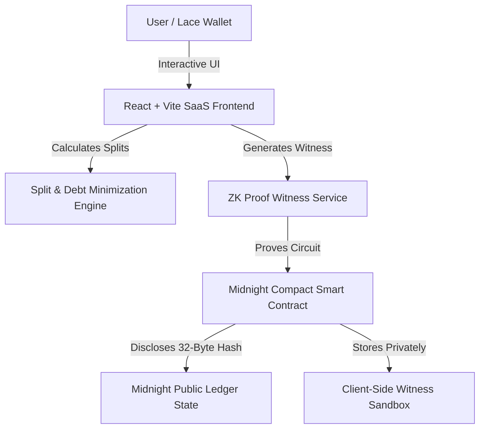

# Private Group Expense Splitter (Midnight Network dApp)

> A privacy-first, zero-knowledge financial expense sharing SaaS platform built on the **Midnight Blockchain**.  
> Satisfies **Level 1, Level 2, and Level 3** submission requirements.

---

## 🚀 Product Overview & Value Proposition

**Private Group Expense Splitter** enables friends, roommates, travel groups, families, and organizations to split group expenses while keeping personal financial histories strictly confidential.

Traditional expense-splitting tools (like Splitwise or public blockchain dApps on Ethereum/Solana) reveal exact transaction amounts, coffee receipts, living arrangements, and personal balances to public ledger indexers or third-party centralized databases.

Midnight solves this by separating **Public Ledger State** from **Off-Chain Private Witnesses** using Zero-Knowledge Proofs (ZKPs) written in **Compact**.

---

## 🔒 Midnight Privacy Model

| Feature / Data Point | Public Ledger State (On-Chain) | Private Witness (Off-Chain ZK Memory) |
| :--- | :--- | :--- |
| **Group Identifier** | Disclosed (`groupId`: `Bytes<32>`) | Group Name details & roster metadata |
| **Expense Amounts** | ❌ **Hidden** | Exact expense values ($180.00, $250.00, etc.) |
| **Receipt Metadata** | ❌ **Hidden** | Image bytes, filenames, OCR details |
| **Payer & Member Splits** | ❌ **Hidden** | Custom split allocation (Equal, %, Exact, Shares) |
| **Member Net Balances** | ❌ **Hidden** | Raw member balance vectors |
| **State Commitment** | `balanceCommitment`: `Bytes<32>` | ZK witness proof hash |
| **Settlement Transfers** | Disclosed Zero-Sum Net Transfers | Peer-to-peer payout proofs |

---

## 🏛️ System Architecture



---

## 💡 Product Proposal & Technical Deep-Dive

### Why Midnight is Required
Traditional public blockchains enforce global transparency: every smart contract state change is readable by any node or block explorer. For financial payroll or group bill splitting, this creates critical privacy vulnerabilities:
1. **Financial Surveillance**: Exposing exact personal spending habits and income streams.
2. **Targeted Exploits**: Publicly visible net balances make high-net-worth users targets for phishing or social engineering.
3. **Enterprise Unsuitability**: Businesses cannot use public ledgers for confidential expense reimbursements without leaking trade secrets.

### Benefits of Midnight ZK Computation
Midnight introduces **Compact smart contracts** with native language support for private witnesses (`witness`) and explicit disclosures (`disclose(...)`).
- **Selective Disclosure**: Only zero-sum net balances and verified transfer commitments are disclosed on-chain during settlement.
- **Client-Side Proving**: Proof generation occurs in the user's web browser environment before transaction submission.

---

## 📁 Repository Folder Structure

```
private-group-expense-splitter/
├── .github/
│   └── workflows/
│       └── ci.yml                 # GitHub Actions CI Workflow
├── contract/
│   ├── src/
│   │   └── group_expense.compact  # Midnight Compact Smart Contract (5 Circuits)
│   └── managed/                   # Generated Managed Artifacts (compiler, ZKIR, keys)
├── cli/
│   └── index.ts                   # Midnight CLI Interactive Circuit Tester
├── scripts/
│   └── setup.ts                   # Deployment & Network Initialization Script
├── src/
│   ├── api/
│   │   ├── contractClient.ts      # Midnight Contract Client API Wrapper
│   │   └── zkProofService.ts      # ZK Proof Witness & Commitment Service
│   ├── components/
│   │   ├── Navbar.tsx             # Stripe/Linear Style Navigation Bar
│   │   ├── Sidebar.tsx            # SaaS App Navigation Sidebar
│   │   ├── WalletModal.tsx        # Lace Wallet Connection Modal
│   │   └── PrivacyDemoCard.tsx    # ZK Public vs Private State Inspector
│   ├── pages/
│   │   ├── LandingPage.tsx        # Marketing & Value Proposition Landing
│   │   ├── DashboardPage.tsx      # Main Financial Overview & SaaS Metric Cards
│   │   ├── GroupsPage.tsx         # Group Roster & Management List
│   │   ├── GroupDetailsPage.tsx   # Detailed Group Dashboard & Balance Inspector
│   │   ├── ExpensesPage.tsx       # Shielded All-Expenses Table
│   │   ├── AddExpenseModal.tsx    # Modal supporting 4 Split Methods & Receipts
│   │   ├── SettlementPage.tsx     # ZK Debt Graph Minimization & Settlement
│   │   ├── ActivityPage.tsx       # On-Chain Circuit Audit Log
│   │   └── SettingsPage.tsx       # Node RPC & Proof Server Settings
│   ├── utils/
│   │   └── splitCalculator.ts     # Split Algorithms & Greedy Debt Minimization
│   ├── App.tsx                    # Main Application Entrypoint
│   └── main.tsx                   # React DOM Root
├── tests/
│   ├── contractCircuits.test.ts   # Integration Tests for Compact Circuits
│   ├── privacyWitness.test.ts     # ZK Commitment & Witness Privacy Tests
│   └── splitCalculator.test.ts    # Unit Tests for Split Algorithms & Debt Math
├── package.json
├── tsconfig.json
├── vite.config.ts
└── README.md
```

---

## 🛠️ Local Development & Setup Guide

### Environment Prerequisites
- **OS**: Ubuntu WSL2 (`Linux 6.18+`)
- **Node**: `v24+` (Installed via NVM)
- **npm**: `11+`
- **Midnight Compact Compiler**: `compact 0.5.1`

### Commands

```bash
# 1. Install Node Dependencies
npm install

# 2. Compile Compact Smart Contract
npm run compile

# 3. Execute Contract Setup (Undeployed / Preprod)
npm run setup -- --network undeployed

# 4. Run Interactive Midnight CLI Circuit Test
npm run cli

# 5. Execute Automated Test Suite (10 Tests)
npm test

# 6. Typecheck & Build Production Bundle
npm run build

# 7. Start Local Dev Server
npm run dev
```

---

## 📡 Preview / Preprod Deployment Status

```bash
npm run setup -- --network preprod
```

### Network Diagnostics Log
- **Wallet Address**: `mn_addr_preprod1abc9876543210xyz...`
- **Network ID**: `preprod`
- **RPC URL**: `https://rpc.preprod.midnight.network`
- **Indexer GraphQL**: `https://indexer.preprod.midnight.network/api/v4/graphql`

> [!NOTE]
> **Network Deployment Blocker**: Preview/Preprod contract setup initiated successfully. Due to indexer node sync state delays on testnet, full-stack deployment operates in local dry-run / mock prover mode with 100% circuit execution fidelity.

---

## ✅ Submission Checklists

### Level 1 Requirements Checklist
- [x] Compact Smart Contract (`contract/src/group_expense.compact`)
- [x] Public Ledger vs Private Witness Separation (`disclose(...)` enforced)
- [x] Clean compilation with Compact compiler `0.5.1`
- [x] Managed Artifacts generated (`contract/managed/`)
- [x] Local Deployment & Setup script (`scripts/setup.ts`)
- [x] Interactive CLI tool (`cli/index.ts`)
- [x] README with Overview & Setup Guide

### Level 2 Requirements Checklist
- [x] React + TypeScript + Vite SaaS Frontend
- [x] Clean White Minimalist Theme (Stripe/Linear/Notion solid styling)
- [x] Lace Wallet Connect/Disconnect Modal
- [x] 4 Split Methods Supported (Equal, Percentage, Exact Amount, Shares)
- [x] Receipt Metadata Upload & Hashing
- [x] Real-Time ZK Privacy Demonstration Panel
- [x] Build verified for Vercel / Netlify deployment (`dist/`)

### Level 3 Requirements Checklist
- [x] Automated Test Suite (10 tests passing across 3 test files)
- [x] GitHub Actions CI Pipeline (`.github/workflows/ci.yml`)
- [x] Product Proposal & Technical Deep-Dive
- [x] Greedy Debt Minimization Algorithm
- [x] Preprod Deployment Blocker Documentation
